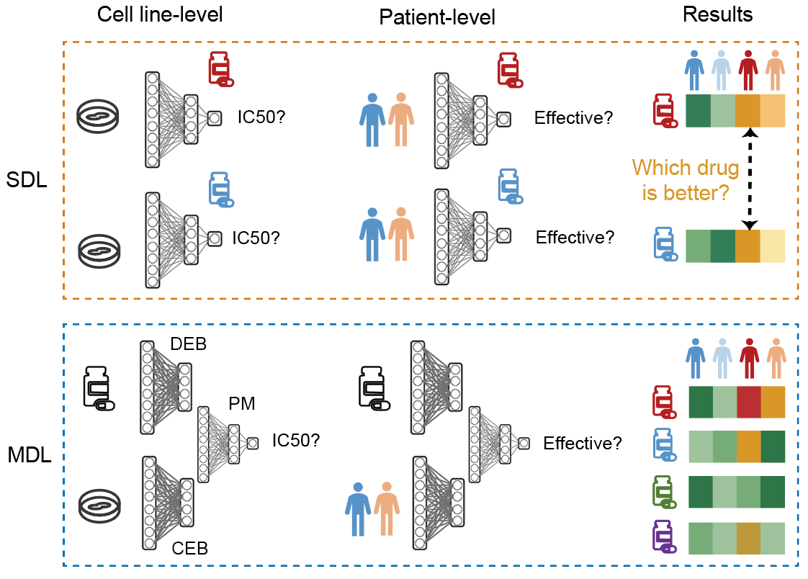
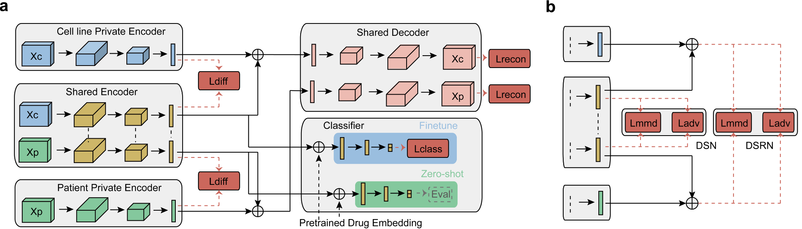

# Multi-Drug-Transfer-Learning
Pre-clinical drug discovery (PDD) faces the low efficiency dilemma. One of the reasons is the lack of cross-drug efficacy evaluation infrastructure at the patient level. Here we propose Patient Multi-Drug Learning(P-MDL) task, and construct the P-MDL dataset and model zoo. The best P-MDL model DSN-adv achieve the SOTA performance in all of the 13 tumor types compared with previous SOTA models. 


## News!

- [07/12] 🔥The code has been updated in Github!


## Features

### P-MDL task
Artificial intelligence (AI) models used for drug response prediction (DRP) tasks are generally classified into Single-Drug learning (SDL) and Multi-Drug Learning (MDL) paradigms. SDL paradigms have been adapted to the patient level and evaluate within-drug response, disregarding tumor types. However, there exist substantial differences in treatment response and survival outcomes among different tumor types, indicating that tumor type is a crucial confounding factor that can not be overlooked when predicting drug response. Additionally, SDL paradigms fail to assess cross-drug response, while MDL paradigms are currently limited to the cell line level. Therefore, we propose the P-MDL approach, which aims to achieve a comprehensive view of drug response at the patient level.

<p align="center">
    
</p>

<!-- {: width="400px" height="300px"} -->

### P-MDL dataset
We constructed the first P-MDL dataset from publicly available data. Tumor types with relatively sufficient data were filtered out. Finally, 13 tumor types were selected for the P-MDL dataset.

<!--  -->
<p align="center">
    
</p>


### P-MDL model zoo

P-MDL model zoo includes eight models employing different transfer learning methods:
| **P-MDL models**  | **Description** | 
| ------- | ------- | 
| **ae**    |  **Autoencoder** used for encoding both of the gene expression profiles (GEPs) of cell lines and patients.   |
| **ae-mmd** | **ae** model added with another **mmd-loss**. | 
| **ae-adv** | **ae** model added with another **adv-loss**. | 
| **dsn**| **Domain seperation network** has been successfully applied in computer vision. Here, it is used for the GEPs encoding of cell lines and patients. | 
| **dsn-adv**| **dsn** model added with another **adv-loss**. | 
| **dsrn** | An variant of **dsn** model.| 
| **dsrn-mmd** | **dsrn** model added with another **mmd-loss**. | 
| **dsrn-adv**| **dsrn** model added with another **adv-loss**. | 

<!-- - **ae**: **Autoencoder** used for encoding both of the gene expression profiles (GEPs) of cell lines and patients.
- **ae-mmd**: **ae** model added with another **mmd-loss**.
- **ae-adv**: **ae** model added with another **adv-loss**.
- **dsn**: **Domain seperation network** has been successfully applied in computer vision. Here, it is used for the GEPs encoding of cell lines and patients.
- **dsn-mmd**: **dsn** model added with another **mmd-loss**.
- **dsn-adv**: **dsn** model added with another **adv-loss**.
- **dsrn**: An variant of **dsn** model.
- **dsrn-mmd**: **dsrn** model added with another **mmd-loss**.
- **dsrn-adv**: **dsrn** model added with another **adv-loss**. -->

<!--  -->

### Patient Drug Response (PDR) prediction for PDD
To further validate the P-MDL models and demonstrate their potential in PDD applications, the test-pairwise pre-trained DSN-adv model was used to screen 233 small molecules for patients of 13 tumor types.
Take tumor type COAD as an example, most drugs were inefficient, but a few drugs showed potential efficacy for over half of COAD patients.

<!-- {: width="200px" height="100px"} -->
<p align="center">
    
</p>


## Installation

To support basic usage of P-MDL task, run the following commands:

```bash
conda create -n P-MDL python=3.8
conda activate P-MDL
conda install -c conda-forge rdkit

pip install torch
pip install pandas
pip install numpy
pip install sklearn
```

## Quick Start

Here, we provide the instruction for a quick start.


<!-- This quick example requires installation of an additional package:
```bash
git clone https://github.com/wuys13/Multi-Drug-Transfer-Learning.git
cd code
python setup.py install
cd ..
``` -->

### Step 1: Data Preparation

Download the data at Zenodo [here](https://zenodo.org/record/8021167). Move the download files to ``data/`` folder.

### Step 2: Training and Evaluation

Run:

```bash
cd code
nohup bash run_pretrain.sh 1>benchmark.txt 2>&1 &
less benchmark.txt
```

The ``benchmark.txt`` will look like the following:
```bash
All-data pre-training (ADP) model runing!
Start to run Test-pairwise pre-training (TPP) model!
...
```

The bash file [run_pretrain.sh](./code/run_pretrain.sh) will run the script [P_MDL.py](./code/P_MDL.py) in a proper params setting. You can also find model Log output in ``records/`` folder and model evaluation results in ``results/`` folder.


<!-- Run:

```bash
cd ../open_biomed
bash scripts/dti/train_baseline_regression.sh
```

The results will look like the following (running takes around 40 minutes on an NVIDIA A100 GPU):

```bash
INFO - __main__ - MSE: 0.2198, Pearson: 0.8529, Spearman: 0.7031, CI: 0.8927, r_m^2: 0.6928
``` -->

### Step 3: Interfence the PDR scores for PDD application

For PDD application, we need to predict the efficacy of all drugs to every patients. So here we set the params ``--select_drug_method all`` to recover the model which can be used for all-drug response prediction. For convenience, you can run the bash file [run_pretrain_for_pdr.sh](./code/run_pretrain_for_pdr.sh) by ```nohup bash run_pretrain_for_pdr.sh 1>pdr_pretrain.txt 2>&1 &```.

Then you can run the bash file [run_pdr_task.sh](./code/run_pdr_task.sh) by ```nohup bash run_pdr_task.sh 1>pdr_task.txt 2>&1 &```, which will call the script [PDR_task.py](./code/PDR_task.py) to predict the efficacy of all drugs to every patients.


## Contact Us

As a pre-alpha version release, we are looking forward to user feedback to help us improve our framework. If you have any questions or suggestions, please open an issue or contact [wuyushuai@mail.tsinghua.edu.cn](wuyushuai@mail.tsinghua.edu.cn).


## Cite Us

If you find our open-sourced code & models helpful to your research, please consider giving this repo a star🌟 and citing📑 the following article. Thank you for your support!
```
@misc{P_MDL_code,
  author={Yushuai Wu},
  title={Code of Multi-Drug-Transfer-Learning},
  year={2023},
  howpublished={\url{https://github.com/wuys13/Multi-Drug-Transfer-Learning.git}}
}
```

## Contributing

If you encounter problems, feel free to create an issue! 